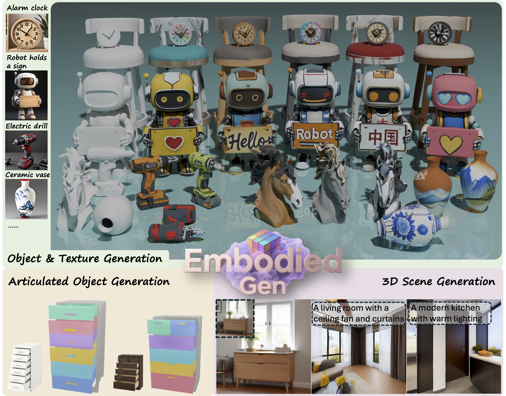

# EmbodiedGen: Towards a Generative 3D World Engine for Embodied Intelligence

[](https://horizonrobotics.github.io/robot_lab/embodied_gen/index.html)
[](#)
[](https://www.youtube.com/watch?v=SnHhzHeb_aI)
[](https://huggingface.co/spaces/HorizonRobotics/EmbodiedGen-Image-to-3D)
[](https://huggingface.co/spaces/HorizonRobotics/EmbodiedGen-Text-to-3D)
[](https://huggingface.co/spaces/HorizonRobotics/EmbodiedGen-Texture-Gen)




**EmbodiedGen** generates interactive 3D worlds with real-world scale and physical realism at low cost.

---

## ✨ Table of Contents of EmbodiedGen
- [🖼️ Image-to-3D](#image-to-3d)
- [📝 Text-to-3D](#text-to-3d)
- [🎨 Texture Generation](#texture-generation)
- [🌍 3D Scene Generation](#3d-scene-generation)
- [⚙️ Articulated Object Generation](#articulated-object-generation)
- [🏞️ Layout Generation](#layout-generation)

## 🚀 Quick Start

```sh
git clone https://github.com/HorizonRobotics/EmbodiedGen.git
cd EmbodiedGen && git submodule update --init --recursive
conda create -n embodiedgen python=3.10.13 -y
conda activate embodiedgen
pip install -r requirements.txt --use-deprecated=legacy-resolver
pip install -e .
```

---

## 🟢 Setup GPT Agent

Update the API key in file: `embodied_gen/utils/gpt_config.yaml`.

You can choose between two backends for the GPT agent:

- **`gpt-4o`** (Recommended) – Use this if you have access to **Azure OpenAI**.
- **`qwen2.5-vl`** – An alternative with free usage via OpenRouter, apply a free key [here](https://openrouter.ai/settings/keys) and update `api_key` in `embodied_gen/utils/gpt_config.yaml` (50 free requests per day)


---

<h2 id="image-to-3d">🖼️ Image-to-3D</h2>

[](https://huggingface.co/spaces/HorizonRobotics/EmbodiedGen-Image-to-3D) Generate physically plausible 3D asset from input image.

### Local Service
Run the image-to-3D generation service locally. The first run will download required models.

```sh
# Run in foreground
python apps/image_to_3d.py
# Or run in the background
CUDA_VISIBLE_DEVICES=0 nohup python apps/image_to_3d.py > /dev/null 2>&1 &
```

### Local API
Generate a 3D model from an image using the command-line API.

```sh
python3 embodied_gen/scripts/imageto3d.py \
    --image_path apps/assets/example_image/sample_04.jpg apps/assets/example_image/sample_19.jpg \
    --output_root outputs/imageto3d/

# See result(.urdf/mesh.obj/mesh.glb/gs.ply) in ${output_root}/sample_xx/result
```

---


<h2 id="text-to-3d">📝 Text-to-3D</h2>

[](https://huggingface.co/spaces/HorizonRobotics/EmbodiedGen-Text-to-3D) Create 3D assets from text descriptions for a wide range of geometry and styles.

### Local Service
Run the text-to-3D generation service locally.

```sh
python apps/text_to_3d.py
```

### Local API

```sh
bash embodied_gen/scripts/textto3d.sh \
    --prompts "small bronze figurine of a lion" "带木质底座，具有经纬线的地球仪" "橙色电动手钻，有磨损细节" \
    --output_root outputs/textto3d/
```

---


<h2 id="texture-generation">🎨 Texture Generation</h2>

[](https://huggingface.co/spaces/HorizonRobotics/EmbodiedGen-Texture-Gen) Generate visually rich textures for 3D mesh.

### Local Service
Run the texture generation service locally.

```sh
python apps/texture_edit.py
```

### Local API
Generate textures for a 3D mesh using a text prompt.

```sh
bash embodied_gen/scripts/texture_gen.sh \
    --mesh_path "apps/assets/example_texture/meshes/robot_text.obj" \
    --prompt "举着牌子的红色写实风格机器人，牌子上写着“Hello”" \
    --output_root "outputs/texture_gen/" \
    --uuid "robot_text"
```

---

<h2 id="3d-scene-generation">🌍 3D Scene Generation</h2>

🚧 *Coming Soon*

---


<h2 id="articulated-object-generation">⚙️ Articulated Object Generation</h2>

🚧 *Coming Soon*

---


<h2 id="layout-generation">🏞️ Layout Generation</h2>

🚧 *Coming Soon*

---

## 📚 Citation

If you use EmbodiedGen in your research or projects, please cite:

```bibtex
Coming Soon
```

---

## 🙌 Acknowledgement

EmbodiedGen builds upon the following amazing projects and models:

- 🌟 [Trellis](https://github.com/microsoft/TRELLIS)
- 🌟 [Hunyuan-Delight](https://huggingface.co/tencent/Hunyuan3D-2/tree/main/hunyuan3d-delight-v2-0)
- 🌟 [Segment Anything Model](https://github.com/facebookresearch/segment-anything)
- 🌟 [Rembg: a tool to remove images background](https://github.com/danielgatis/rembg)
- 🌟 [RMBG-1.4: BRIA Background Removal](https://huggingface.co/briaai/RMBG-1.4)
- 🌟 [stable-diffusion-x4-upscaler](https://huggingface.co/stabilityai/stable-diffusion-x4-upscaler)
- 🌟 [Real-ESRGAN](https://github.com/xinntao/Real-ESRGAN)
- 🌟 [Kolors](https://github.com/Kwai-Kolors/Kolors)
- 🌟 [ChatGLM3](https://github.com/THUDM/ChatGLM3)
- 🌟 [Aesthetic Score Model](http://captions.christoph-schuhmann.de/aesthetic_viz_laion_sac+logos+ava1-l14-linearMSE-en-2.37B.html)
- 🌟 [Pano2Room](https://github.com/TrickyGo/Pano2Room)
- 🌟 [Diffusion360](https://github.com/ArcherFMY/SD-T2I-360PanoImage)
- 🌟 [kaolin](https://github.com/NVIDIAGameWorks/kaolin)
- 🌟 [diffusers](https://github.com/huggingface/diffusers)
- 🌟 GPT: QWEN2.5VL, GPT4o

---

## ⚖️ License

This project is licensed under the [Apache License 2.0](LICENSE). See the `LICENSE` file for details.