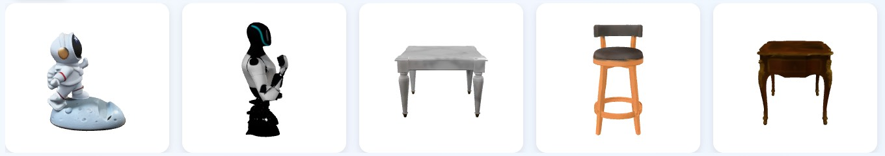
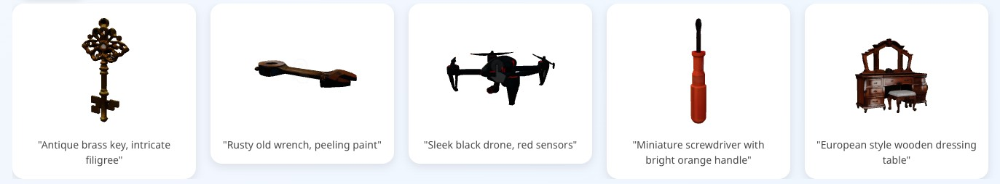
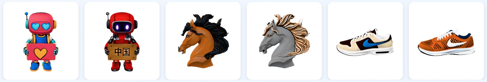
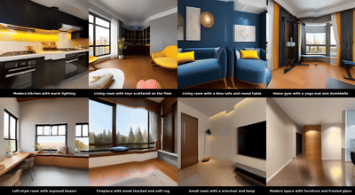
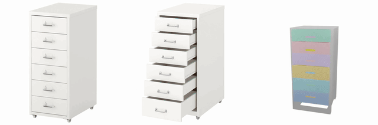
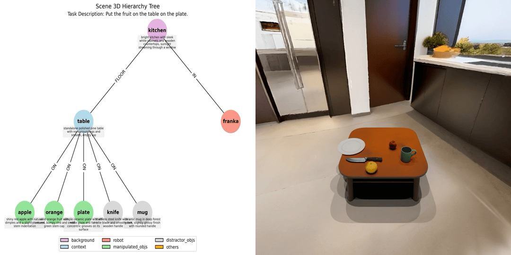
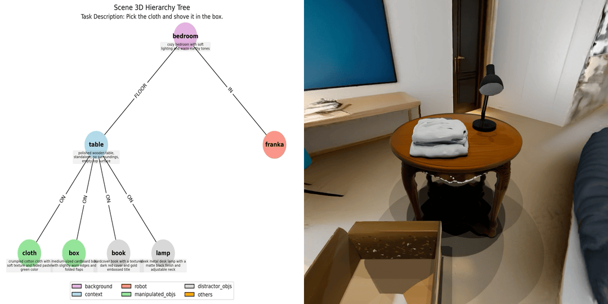
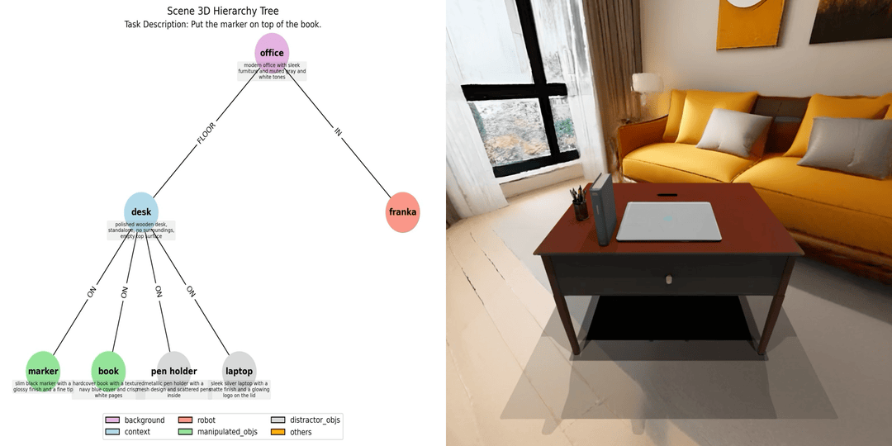
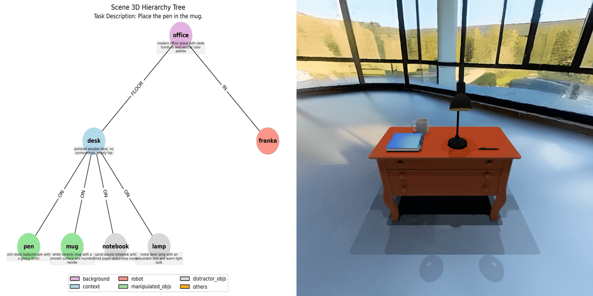
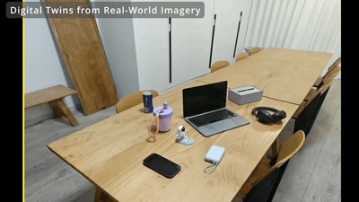

# *EmbodiedGen*: Towards a Generative 3D World Engine for Embodied Intelligence

[](https://horizonrobotics.github.io/robot_lab/embodied_gen/index.html)
[](https://arxiv.org/abs/2506.10600)
[](https://www.youtube.com/watch?v=rG4odybuJRk)
[](https://huggingface.co/spaces/HorizonRobotics/EmbodiedGen-Image-to-3D)
[](https://huggingface.co/spaces/HorizonRobotics/EmbodiedGen-Text-to-3D)
[](https://huggingface.co/spaces/HorizonRobotics/EmbodiedGen-Texture-Gen)


> ***EmbodiedGen*** is a generative engine to create diverse and interactive 3D worlds composed of high-quality 3D assets(mesh & 3DGS) with plausible physics, leveraging generative AI to address the challenges of generalization in embodied intelligence related research.
> It composed of six key modules: `Image-to-3D`, `Text-to-3D`, `Texture Generation`, `Articulated Object Generation`, `Scene Generation` and `Layout Generation`.


---

## ✨ Table of Contents of EmbodiedGen
- [🖼️ Image-to-3D](#image-to-3d)
- [📝 Text-to-3D](#text-to-3d)
- [🎨 Texture Generation](#texture-generation)
- [🌍 3D Scene Generation](#3d-scene-generation)
- [⚙️ Articulated Object Generation](#articulated-object-generation)
- [🏞️ Layout (Interactive 3D Worlds) Generation](#layout-generation)

## 🚀 Quick Start

### ✅ Setup Environment
```sh
git clone https://github.com/HorizonRobotics/EmbodiedGen.git
cd EmbodiedGen
git checkout v0.1.0
git submodule update --init --recursive --progress
conda create -n embodiedgen python=3.10.13 -y
conda activate embodiedgen
bash install.sh
```

### ✅ Setup GPT Agent

Update the API key in file: `embodied_gen/utils/gpt_config.yaml`.

You can choose between two backends for the GPT agent:

- **`gpt-4o`** (Recommended) – Use this if you have access to **Azure OpenAI**.
- **`qwen2.5-vl`** – An alternative with free usage via OpenRouter, apply a free key [here](https://openrouter.ai/settings/keys) and update `api_key` in `embodied_gen/utils/gpt_config.yaml` (50 free requests per day)


---

<h2 id="image-to-3d">🖼️ Image-to-3D</h2>

[](https://huggingface.co/spaces/HorizonRobotics/EmbodiedGen-Image-to-3D) Generate physically plausible 3D asset URDF from single input image, offering high-quality support for digital twin systems.



### ☁️ Service
Run the image-to-3D generation service locally.
Models downloaded automatically on first run, please be patient.
```sh
# Run in foreground
python apps/image_to_3d.py
# Or run in the background
CUDA_VISIBLE_DEVICES=0 nohup python apps/image_to_3d.py > /dev/null 2>&1 &
```

### ⚡ API
Generate physically plausible 3D assets from image input via the command-line API.
```sh
python3 embodied_gen/scripts/imageto3d.py \
    --image_path apps/assets/example_image/sample_04.jpg apps/assets/example_image/sample_19.jpg \
    --output_root outputs/imageto3d

# See result(.urdf/mesh.obj/mesh.glb/gs.ply) in ${output_root}/sample_xx/result
```

---


<h2 id="text-to-3d">📝 Text-to-3D</h2>

[](https://huggingface.co/spaces/HorizonRobotics/EmbodiedGen-Text-to-3D) Create 3D assets from text descriptions for a wide range of geometry and styles.



### ☁️ Service
Deploy the text-to-3D generation service locally.

Text-to-image based on the Kolors model, supporting Chinese and English prompts.
Models downloaded automatically on first run, see `download_kolors_weights`, please be patient.
```sh
python apps/text_to_3d.py
```

### ⚡ API
Text-to-image based on the Kolors model.
```sh
bash embodied_gen/scripts/textto3d.sh \
    --prompts "small bronze figurine of a lion" "A globe with wooden base and latitude and longitude lines" "橙色电动手钻，有磨损细节" \
    --output_root outputs/textto3d
```

---


<h2 id="texture-generation">🎨 Texture Generation</h2>

[](https://huggingface.co/spaces/HorizonRobotics/EmbodiedGen-Texture-Gen) Generate visually rich textures for 3D mesh.




### ☁️ Service
Run the texture generation service locally.
Models downloaded automatically on first run, see `download_kolors_weights`, `geo_cond_mv`.
```sh
python apps/texture_edit.py
```

### ⚡ API
```sh
bash embodied_gen/scripts/texture_gen.sh \
    --mesh_path "apps/assets/example_texture/meshes/robot_text.obj" \
    --prompt "举着牌子的写实风格机器人，大眼睛，牌子上写着“Hello”的文字" \
    --output_root "outputs/texture_gen/" \
    --uuid "robot_text"
```

---

<h2 id="3d-scene-generation">🌍 3D Scene Generation</h2>

🚧 *Coming Soon*



---


<h2 id="articulated-object-generation">⚙️ Articulated Object Generation</h2>

🚧 *Coming Soon*




---


<h2 id="layout-generation">🏞️ Layout(Interactive 3D Worlds) Generation</h2>

### 💬 Generate Layout from task description

🚧 *Coming Soon*

<table>
  <tr>
    <td></td>
    <td></td>
  </tr>
  <tr>
    <td></td>
    <td></td>
  </tr>
</table>


### 🖼️ Real-to-Sim Digital Twin



---

## 📚 Citation

If you use EmbodiedGen in your research or projects, please cite:

```bibtex
@misc{wang2025embodiedgengenerative3dworld,
      title={EmbodiedGen: Towards a Generative 3D World Engine for Embodied Intelligence},
      author={Xinjie Wang and Liu Liu and Yu Cao and Ruiqi Wu and Wenkang Qin and Dehui Wang and Wei Sui and Zhizhong Su},
      year={2025},
      eprint={2506.10600},
      archivePrefix={arXiv},
      primaryClass={cs.RO},
      url={https://arxiv.org/abs/2506.10600},
}
```

---

## 🙌 Acknowledgement

EmbodiedGen builds upon the following amazing projects and models:
🌟 [Trellis](https://github.com/microsoft/TRELLIS) | 🌟 [Hunyuan-Delight](https://huggingface.co/tencent/Hunyuan3D-2/tree/main/hunyuan3d-delight-v2-0) | 🌟 [Segment Anything](https://github.com/facebookresearch/segment-anything) | 🌟 [Rembg](https://github.com/danielgatis/rembg) | 🌟 [RMBG-1.4](https://huggingface.co/briaai/RMBG-1.4) | 🌟 [Stable Diffusion x4](https://huggingface.co/stabilityai/stable-diffusion-x4-upscaler) | 🌟 [Real-ESRGAN](https://github.com/xinntao/Real-ESRGAN) | 🌟 [Kolors](https://github.com/Kwai-Kolors/Kolors) | 🌟 [ChatGLM3](https://github.com/THUDM/ChatGLM3) | 🌟 [Aesthetic Score](http://captions.christoph-schuhmann.de/aesthetic_viz_laion_sac+logos+ava1-l14-linearMSE-en-2.37B.html) | 🌟 [Pano2Room](https://github.com/TrickyGo/Pano2Room) | 🌟 [Diffusion360](https://github.com/ArcherFMY/SD-T2I-360PanoImage) | 🌟 [Kaolin](https://github.com/NVIDIAGameWorks/kaolin) | 🌟 [diffusers](https://github.com/huggingface/diffusers) | 🌟 [gsplat](https://github.com/nerfstudio-project/gsplat) | 🌟 [QWEN2.5VL](https://github.com/QwenLM/Qwen2.5-VL) | 🌟 [GPT4o](https://platform.openai.com/docs/models/gpt-4o)

---

## ⚖️ License

This project is licensed under the [Apache License 2.0](LICENSE). See the `LICENSE` file for details.
